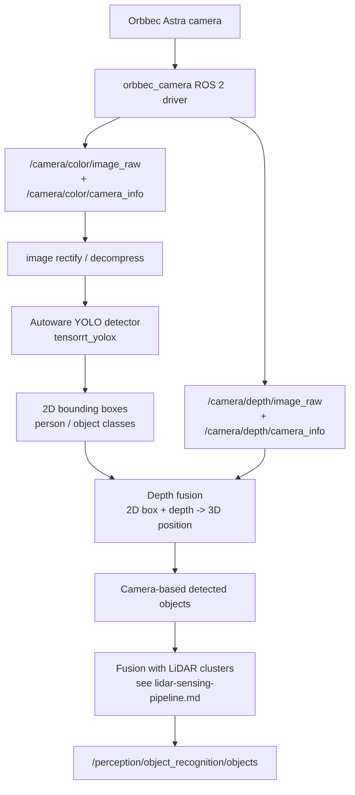

# Camera Sensing Pipeline — Integrating a New Camera

This is a forward-looking integration guide, NOT a record of completed work
— camera-based perception has not yet been added to this platform. It covers how to
bring a new camera (in our case, an Orbbec Astra RGB-D camera) into the existing
Autoware installation on the Jetson AGX Orin, following the same pattern used for the
Ouster LiDAR integration (see `CHANGES.md` Section 4).

## Pipeline overview



This mirrors the LiDAR pipeline's structure: a driver produces raw sensor data, that
data is converted/rectified into a usable format, a detector turns raw data into
candidate objects, and those candidates get fused and tracked before reaching the
same final objects topic the planner consumes.

## Integration steps

### 1. Install the camera's ROS 2 driver

```bash
cd ~/ros2_ws/src
git clone https://github.com/orbbec/OrbbecSDK_ROS2.git
cd ~/ros2_ws
colcon build --packages-select orbbec_camera
source install/setup.bash
```

### 2. Launch the driver standalone and verify raw topics

Bring up just the camera driver first, independent of Autoware, the same way the OS0
driver is brought up before the rest of the LiDAR pipeline. Confirm image and depth
topics are actually publishing before touching any Autoware configuration:

```bash
ros2 topic hz /camera/color/image_raw
ros2 topic hz /camera/depth/image_raw
ros2 topic echo --once /camera/color/camera_info
```

If `camera_info` isn't populated correctly (zero or default intrinsics), the camera
needs proper intrinsic calibration before anything downstream — a wrong focal length
or principal point will quietly produce wrong 3D positions later in the depth-fusion
step, the same class of "no error, just wrong" failure mode seen with the LiDAR's
QoS/format mismatches.

### 3. Add the camera to the sensor kit description

Following the same approach used for the Ouster LiDAR (`CHANGES.md` Section 4.1–4.2):

- Extend `sensor_kit.xacro` with a new frame for the camera (e.g.
  `sensor_kit_base_link → camera_link`), matching wherever it's physically mounted
  relative to the existing `os_sensor` frame.
- Measure and add the camera's extrinsic calibration — translation and rotation
  relative to `sensor_kit_base_link` — to `sensor_kit_calibration.yaml`. As with the
  OS0's cable-orientation issue, double-check the camera's physical forward axis
  against the vehicle's forward axis before finalizing this; a wrong rotation here
  produces detections that are spatially offset or mirrored in a way that's easy to
  miss until LiDAR-camera fusion is tested.
- Re-verify the full TF tree end-to-end with `ros2 run tf2_tools view_frames` after
  the new frame is added, exactly as was done for every LiDAR-side TF change.

### 4. Wire the camera into Autoware's sensing launch

Point Autoware's sensing launch arguments at the new camera's topics (image,
camera_info, and namespace), matching whatever naming convention the rest of the
sensor kit uses, so the camera's data is visible to the same launch system that
already brings up the LiDAR sensing pipeline.

### 5. Sanity-check fusion alignment visually

Before trusting any detection output, visualize the raw camera image alongside the
LiDAR pointcloud projected into the camera frame in RViz2. If the extrinsic
calibration from step 3 is correct, LiDAR points belonging to an object (a person, a
wall) should visibly line up with that same object in the camera image. This is the
fastest way to catch a calibration error before it shows up as a subtler bug several
stages downstream.

### 6. Confirm time synchronization

Camera and LiDAR data arrive on independent clocks and at independent rates. Before
relying on any fused detection, confirm the timestamps on `/camera/color/image_raw`
and the LiDAR pointcloud topics are close enough together (well within Autoware's
sync tolerance) that fusion isn't pairing a camera frame with a LiDAR scan from a
meaningfully different moment in time — especially relevant on this platform since
the LiDAR pipeline already required explicit QoS and timestamp-mode configuration to
behave correctly (`CHANGES.md` Section 1–2).

## Next step

Once raw camera topics are confirmed correct, calibrated, and time-synchronized with
the existing LiDAR pipeline, the next step is to bring up Autoware's built-in YOLO
implementation (`tensorrt_yolox`) pointed at the camera's image topic, and confirm
classified, camera-based detections are arriving on the **`/pred_objects`** topic.
